基于ssm（非maven）项目的宿舍管理系统

源码下载地址：http://www.manoncode.cn/details?id=59

项目框架：ssm+jsp等
本系统分为二种权限：

1.超级管理员：学生管理，班级管理，班级学生管理，宿舍管理，宿舍人员管理，维修登记，
卫生管理（宿舍卫生以及学生卫生），访客管理，管理员管理

2.普通管理员：在所有菜单的基础上少一个操作管理员的权限

高级登陆：账号 mx 密码111111

CSDN博客地址：[基于ssm（非maven）项目的宿舍管理系统](https://blog.csdn.net/mataodehtml/article/details/113694440)

运行截图：

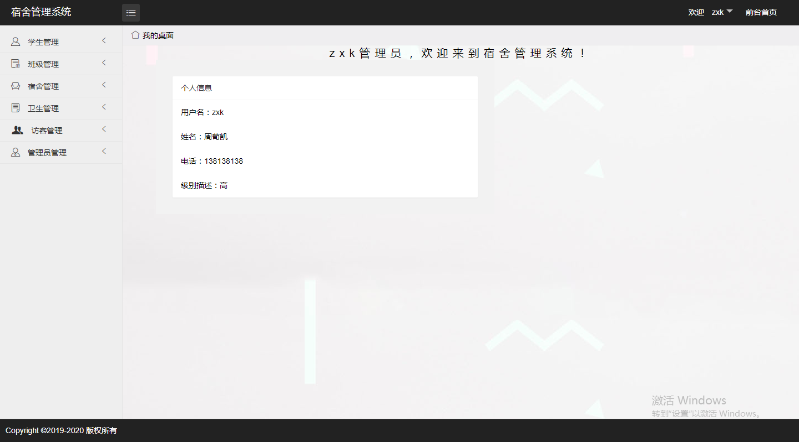

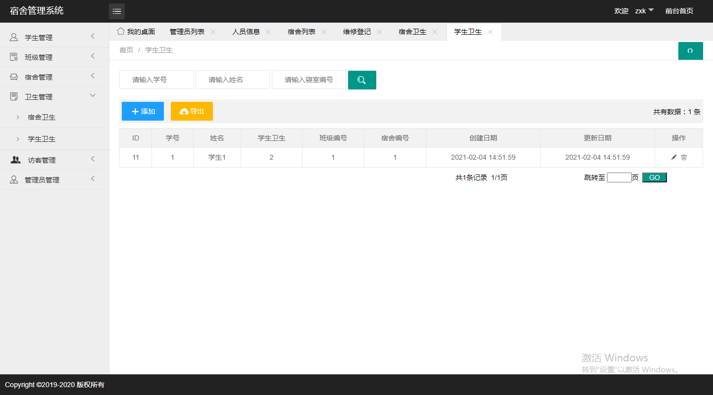

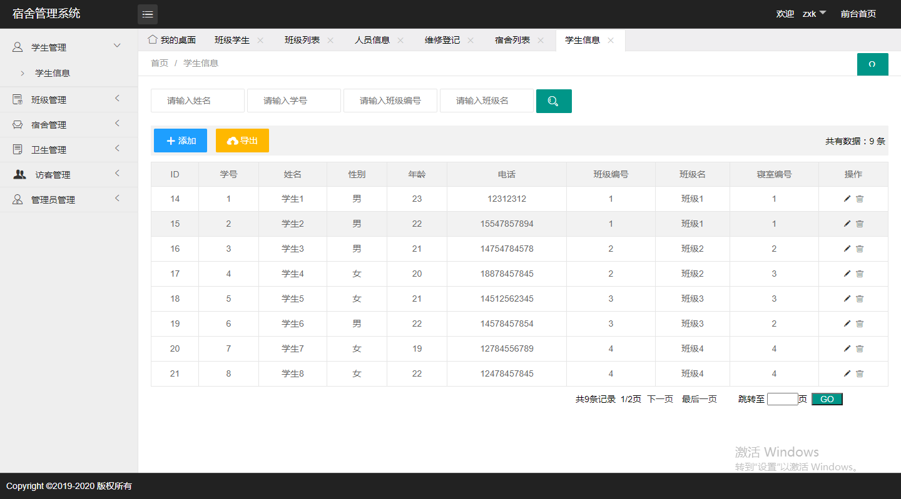

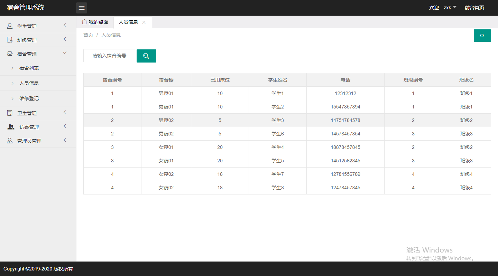

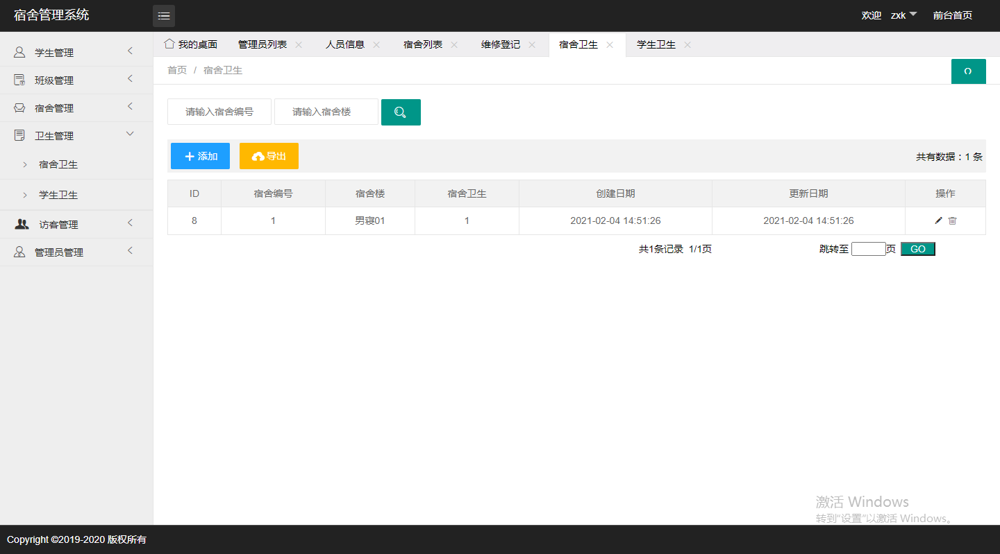

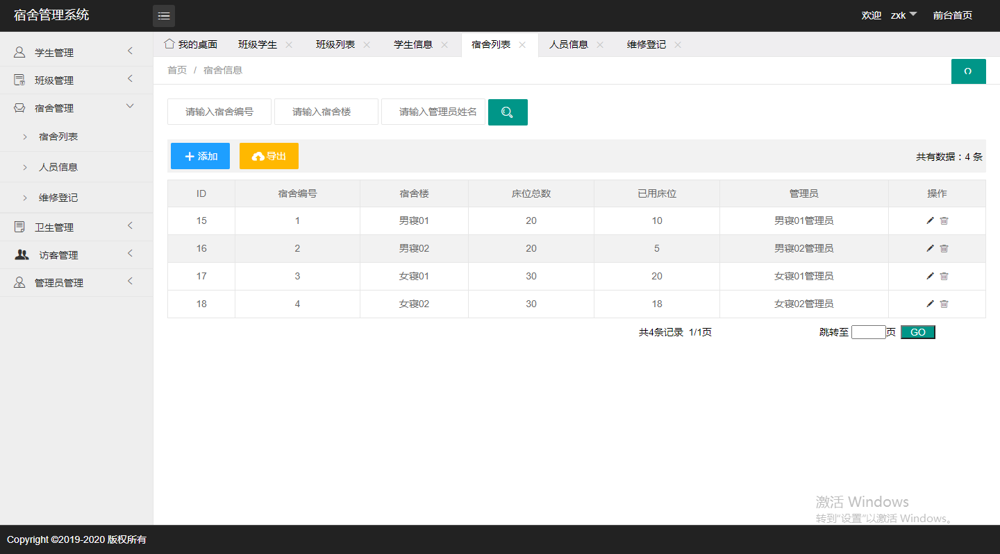

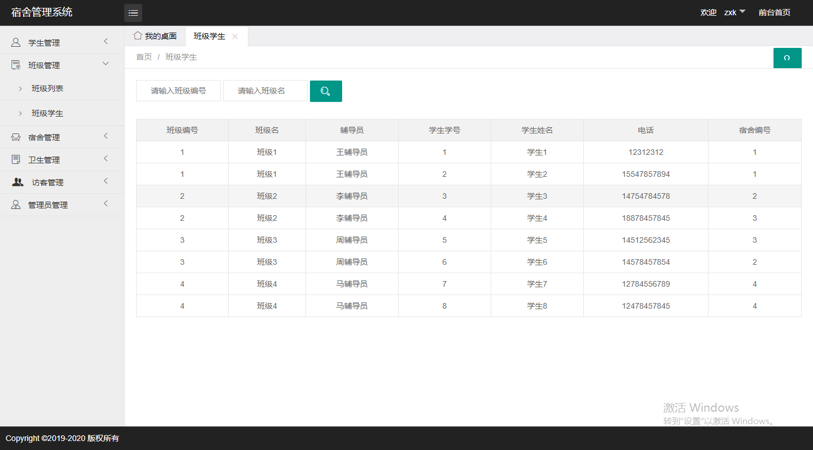

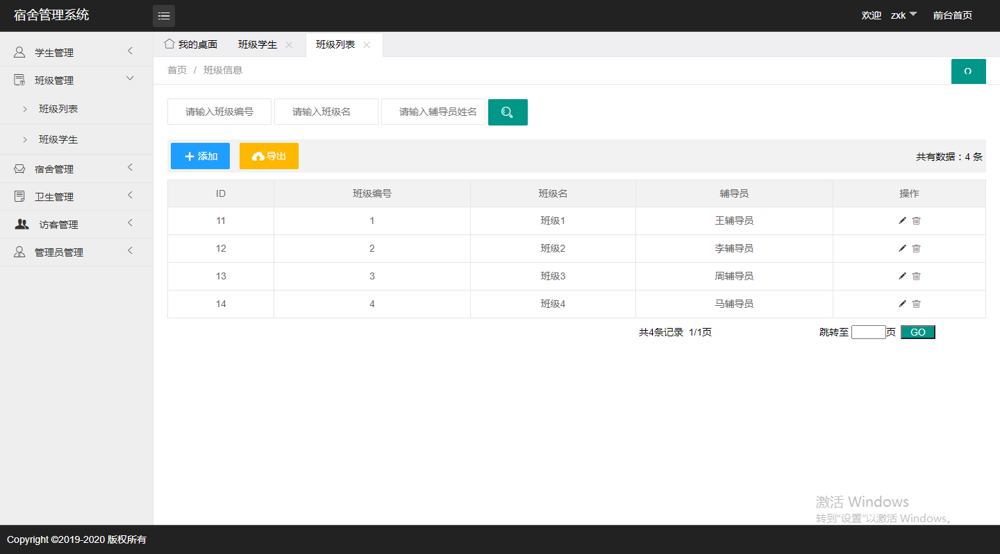

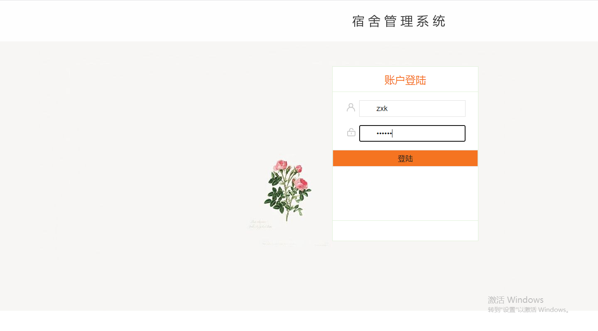

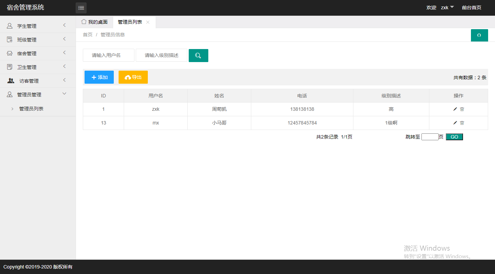

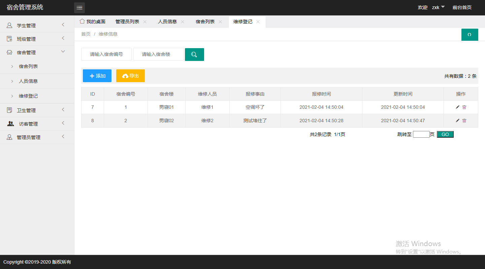

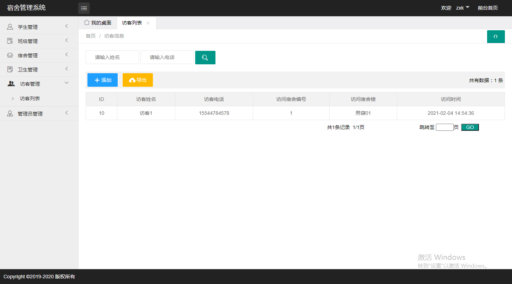
